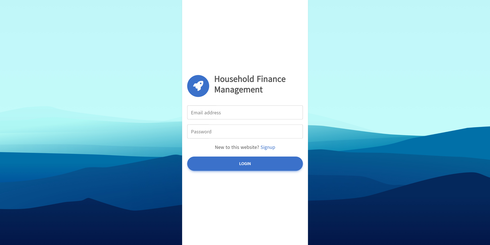
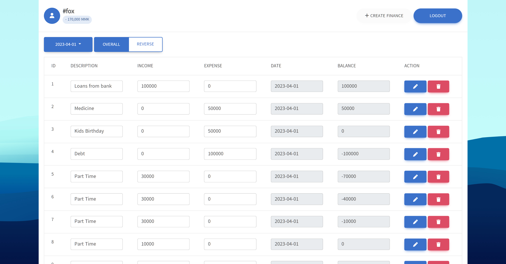

# Simple finance management app with (MVC architecture)

## Dev Note

`1.0.0`

- ✨ Can do basic stuff
- ✅ Sql file is included in root folder
- ⚠️ Sql file contain users table & overall table, so you need to import the sql file into your database
- ⚠️ You will also need change the database name in Models\Database.php file,
  `  $dbname = 'your database'`
- ✅ Easy to use ui

## App Screenshot 📷

